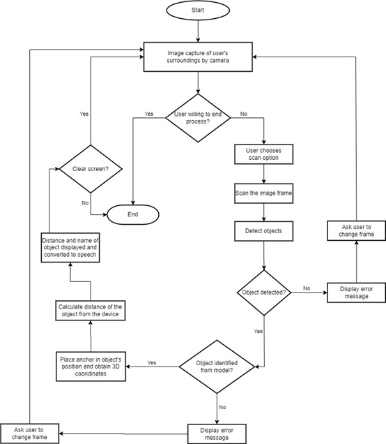

# Objective
- The idea is to create an affordable device accessible to people across all sections of society.
- This solution is designed to detect obstacles in real-time and provide instantaneous feedback to users to enhance safety and independence.
- Central to the project is the commitment to ensuring accessibility for visually impaired individuals.

# ARCore ML sample

A [Google ARCore](https://developers.google.com/ar) sample demonstrating how to use camera images as an input for machine learning algorithms, and how to use the results of the inference model to create anchors in the AR scene.

  

This sample leverages [ML Kit's Object Detection](https://developers.google.com/ml-kit/vision/object-detection) to identify objects in real-time using device camera. Additionally, it can optionally utilize [Google's Cloud Vision API](https://cloud.google.com/vision/docs/object-localizer) for enhanced object identification.

# Application Workflow

  

## Getting Started
To try this app, you'll need the following:

 * An ARCore compatible device running [Google Play Services for AR](https://play.google.com/store/apps/details?id=com.google.ar.core) (ARCore) 1.24 or later. Refer, [this link](https://developers.google.com/ar/devices) for the list of compatible devices.
 * Android Studio 4.1 or later
 
### Using custom classification model
By default, this sample utilizes ML Kit's built-in coarse classifier, which is designed to recognize only five categories, offering limited details about the detected objects.

For better classification results:
1. Read [Label images with a custom model on Android](https://developers.google.com/ml-kit/vision/object-detection/custom-models/android) on ML Kit's documentation website and check [TensorFlow Models Models for Object Detection](https://www.kaggle.com/models?task=17074).
2. Modify `MLKitObjectAnalyzer.kt` in `app/src/main/java/com/google/ar/core/examples/java/ml/classification/` to specify a custom model.